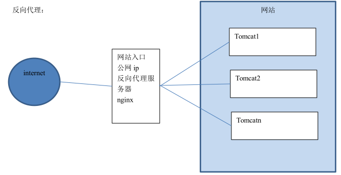

# 02-nginx基础

Nginx 是一款高性能的 http 服务器/反向代理服务器及电子邮件（IMAP/POP3）代理服务器。由俄罗斯的程序设计师伊戈尔·西索夫（Igor Sysoev）所开发，官方测试 nginx 能够支支撑 5 万并发链接，并且 cpu、内存等资源消耗却非常低，运行非常稳定。

Nginx应用场景：
- （1）http 服务器：Nginx 是一个 http 服务可以独立提供 http 服务。可以做网页静态服务器。
- （2）虚拟主机：可以实现在一台服务器虚拟出多个网站。例如个人网站使用的虚拟主机。
- （3）反向代理，负载均衡：当网站的访问量达到一定程度后，单台服务器不能满足用户的请求时，需要用多台服务器集群可以使用 nginx 做反向代理。并且多台服务器可以平均分担负载，不会因为某台服务器负载高宕机而某台服务器闲置的情况。

### 一、nginx 安装
Nginx在Linux下的安装    
重新准备一台虚拟机作为服务器。比如IP地址为192.168.121.132

#### 1、需要安装gcc环境
```
yum install gcc-c++  
```
#### 2、第三方的开发包
PCRE(Perl Compatible Regular Expressions)是一个 Perl 库，包括 perl 兼容的正则表达式库。nginx 的 http 模块使用 pcre 来解析正则表达式，所以需要在 linux 上安装 pcre 库。
```
yum install -y pcre pcre-devel
```
注：pcre-devel 是使用 pcre 开发的一个二次开发库。nginx 也需要此库。

zlib：zlib 库提供了很多种压缩和解压缩的方式，nginx 使用 zlib 对 http 包的内容进行 gzip，所以需要在 linux 上安装 zlib 库。
```
yum install -y zlib zlib-devel
```
OpenSSL：OpenSSL 是一个强大的安全套接字层密码库，囊括主要的密码算法、常用的密钥和证书封装管理功能及 SSL 协议，并提供丰富的应用程序供测试或其它目的使用。nginx 不仅支持 http 协议，还支持 https（即在 ssl 协议上传输 http），所以需要在 linux安装 openssl 库。
```
yum install -y openssl openssl-devel
```

#### 2、nginx 下载安装
官方网站下载 nginx：http://nginx.org/

解压
```
tar zxvf nginx-1.8.0.tar.gz
```

进入nginx-1.8.0目录，使用 configure 命令创建一  makeFile  文件。
```
./configure \
--prefix=/usr/local/nginx \
--pid-path=/var/run/nginx/nginx.pid \
--lock-path=/var/lock/nginx.lock \
--error-log-path=/var/log/nginx/error.log \
--http-log-path=/var/log/nginx/access.log \
--with-http_gzip_static_module \
--http-client-body-temp-path=/var/temp/nginx/client \
--http-proxy-temp-path=/var/temp/nginx/proxy \
--http-fastcgi-temp-path=/var/temp/nginx/fastcgi \
--http-uwsgi-temp-path=/var/temp/nginx/uwsgi \
--http-scgi-temp-path=/var/temp/nginx/scgi
```

makefile详解：
```
----  附注 ----
Makefile是一种配置文件， Makefile 一个工程中的源文件不计数，其按类型、功能、模块分别放在若干个目录中，makefile定义了一系列的规则来指定，哪些文件需要先编译，哪些文件需要后编译，哪些文件需要重新编译，甚至于进行更复杂的功能操作，因为 makefile就像一个Shell脚本一样，其中也可以执行操作系统的命令。
----  附注 ----
configure参数
./configure \
--prefix=/usr \                                 指向安装目录
--sbin-path=/usr/sbin/nginx \                   指向（执行）程序文件（nginx）
--conf-path=/etc/nginx/nginx.conf \             指向配置文件
--error-log-path=/var/log/nginx/error.log \     指向log
--http-log-path=/var/log/nginx/access.log \     指向http-log
--pid-path=/var/run/nginx/nginx.pid \           指向pid
--lock-path=/var/lock/nginx.lock \             （安装文件锁定，防止安装文件被别人利用，或自己误操作。）
--user=nginx \
--group=nginx \
--with-http_ssl_module \     启用ngx_http_ssl_module支持（使支持https请求，需已安装openssl）
--with-http_flv_module \     启用ngx_http_flv_module支持（提供寻求内存使用基于时间的偏移量文件）
--with-http_stub_status_module \   启用ngx_http_stub_status_module支持（获取nginx自上次启动以来的工作状态）
--with-http_gzip_static_module \   启用ngx_http_gzip_static_module支持（在线实时压缩输出数据流）
--http-client-body-temp-path=/var/tmp/nginx/client/ \ 设定http客户端请求临时文件路径
--http-proxy-temp-path=/var/tmp/nginx/proxy/ \ 设定http代理临时文件路径
--http-fastcgi-temp-path=/var/tmp/nginx/fcgi/ \ 设定http fastcgi临时文件路径
--http-uwsgi-temp-path=/var/tmp/nginx/uwsgi \ 设定http uwsgi临时文件路径
--http-scgi-temp-path=/var/tmp/nginx/scgi \ 设定http scgi临时文件路径
--with-pcre 启用pcre库
```

编译
```
make
```

安装
```
make install
```

### 二、nginx 启动与访问
注意：启动nginx 之前，上边将临时文件目录指定为/var/temp/nginx/client， 需要在/var 下创建此目录。
```
mkdir /var/temp/nginx/client -p
```

进入到Nginx目录下的sbin目录
```
cd /usr/local/nginx/sbin
```
输入命令启动Nginx
```
./nginx
```
启动后查看进程
```
ps aux|grep nginx
```
地址栏输入虚拟机的IP即可访问（默认为80端口）。
关闭 nginx：
```
./nginx -s stop
```
或者
```
./nginx -s quit
```
重启 nginx：
- a、先关闭后启动。
- b、刷新配置文件：
```
./nginx -s reload
```


### 三、nginx静态网站部署

#### 3.1、静态网站的部署
将/资料/静态页面/index目录下的所有内容 上传到服务器的/usr/local/nginx/html下即可访问。

#### 3.2、配置虚拟主机
虚拟主机，也叫“网站空间”，就是把一台运行在互联网上的物理服务器划分成多个“虚拟”服务器。虚拟主机技术极大的促进了网络技术的应用和普及。同时虚拟主机的租用服务也成了网络时代的一种新型经济形式。

##### 3.2.1、端口绑定
初始版本：
```
server {
    listen       81; # 监听的端口
    server_name  localhost; # 域名或ip
    location / {    # 访问路径配置
        root   index;# 根目录
        index  index.html index.htm; # 默认首页
    }
    error_page   500 502 503 504  /50x.html;    # 错误页面
    location = /50x.html {
        root   html;
    }
}


 server {
    listen       82; # 监听的端口
    server_name  localhost; # 域名或ip
    location / {    # 访问路径配置
        root   regist;# 根目录
        index  regist.html; # 默认首页
    }
    error_page   500 502 503 504  /50x.html;    # 错误页面
    location = /50x.html {
        root   html;
    }
}
```

修改Nginx 的配置文件：/usr/local/nginx/conf/nginx.conf
```
server {
        listen       80;    #监听的端口号
        server_name  heimatravel.com;    #域名或ip  一级域名

        location / {    #访问路径配置
            root   regist;    #根目录
            index  regist.html regist.htm;    #默认首页
        }

        error_page   500 502 503 504  /50x.html;    #错误页面
        location = /50x.html {
            root   html;
        }
    }

server {
        listen       81;
        server_name  regist.heimatravel.com;

        location / {
            root   regist;
            index  regist.html regist.htm;
        }

        error_page   500 502 503 504  /50x.html;
        location = /50x.html {
            root   html;
        }
    }
```

##### 3.2.2、域名绑定
什么是域名：
> 域名（Domain Name），是由一串用“点”分隔的字符组成的Internet上某一台计算机或计算机组的名称，用于在数据传输时标识计算机的电子方位（有时也指地理位置，地理上的域名，指代有行政自主权的一个地方区域）。域名是一个IP地址上有“面具” 。域名的目的是便于记忆和沟通的一组服务器的地址（网站，电子邮件，FTP等）。域名作为力所能及难忘的互联网参与者的名称。域名按域名系统（DNS）的规则流程组成。在DNS中注册的任何名称都是域名。域名用于各种网络环境和应用程序特定的命名和寻址目的。通常，域名表示互联网协议（IP）资源，例如用于访问因特网的个人计算机，托管网站的服务器计算机，或网站本身或通过因特网传送的任何其他服务。世界上第一个注册的域名是在1985年1月注册的。

域名级别：   
顶级域名又分为两类：       
- 一是国家顶级域名（national top-level domainnames，简称nTLDs），200多个国家都按照ISO3166国家代码分配了顶级域名，例如中国是cn，美国是us，日本是jp等；
- 二是国际顶级域名（international top-level domain names，简称iTDs），例如表示工商企业的 .Com .Top，表示网络提供商的.net，表示非盈利组织的.org，表示教育的.edu，以及没有限制的中性域名如.xyz等。大多数域名争议都发生在com的顶级域名下，因为多数公司上网的目的都是为了赢利。但因为自2014年以来新顶级域名的发展，域名争议案件数量增长幅度越来越大[5]  。为加强域名管理，解决域名资源的紧张，Internet协会、Internet分址机构及世界知识产权组织（WIPO）等国际组织经过广泛协商， 在原来三个国际通用顶级域名：（com）的基础上，新增加了7个国际通用顶级域名：firm（公司企业）、store（销售公司或企业）、Web（突出WWW活动的单位）、arts（突出文化、娱乐活动的单位）、rec (突出消遣、娱乐活动的单位）、info(提供信息服务的单位）、nom(个人），并在世界范围内选择新的注册机构来受理域名注册申请。例如：baidu.com

二级域名：      
二级域名是指顶级域名之下的域名，在国际顶级域名下，它是指域名注册人的网上名称，例如 ibm，yahoo，microsoft等；在国家顶级域名下，它是表示注册企业类别的符号，例如.top，com，edu，gov，net等。

中国在国际互联网络信息中心（Inter NIC） 正式注册并运行的顶级域名是CN，这也是中国的一级域名。在顶级域名之下，中国的二级域名又分为类别域名和行政区域名两类。类别域名共7个， 包括用于科研机构的ac；用于工商金融企业的com、top；用于教育机构的edu；用于政府部门的 gov；用于互联网络信息中心和运行中心的net；用于非盈利组织的org。而行政区域名有34个，分别对应于中国各省、自治区和直辖市。

三级域名：    
三级域名用字母（ A～Z，a～z，大小写等）、数字（0～9）和连接符（－）组成， 各级域名之间用实点（.）连接，三级域名的长度不能超过20个字符。如无特殊原因，建议采用申请人的英文名（或者缩写）或者汉语拼音名 （或者缩写） 作为三级域名，以保持域名的清晰性和简洁性。


域名和IP绑定：    
一个域名对应一个 ip 地址，一个 ip 地址可以被多个域名绑定。    
可以配置域名和 ip 的映射关系，如果 hosts 文件中配置了域名和 ip 的对应关系，不需要走dns 服务器。
```
　　192.168.121.132     www.hmtravel.com
　　192.168.121.132     regist.hmtravel.com
```
做好域名指向后，修改nginx配置文件：
```
server {
    listen       80;
    server_name  www.hmtravel.com;
    location / {
        root   cart;
        index  cart.html;
    }
}
server {
    listen       80;
    server_name  regist.hmtravel.com;
    location / {
        root   search;
        index  search.html;
    }
}
```
执行以下命令，刷新配置
```
./nginx -s reload
```


### 四、Nginx反向代理与负载均衡
#### 4.1、反向代理
##### 4.1.1什么是反向代理
- 反向代理（Reverse Proxy）方式是指以代理服务器来接受internet上的连接请求，然后将请求转发给内部网络上的服务器，并将从服务器上得到的结果返回给internet上请求连接的客户端，此时代理服务器对外就表现为一个反向代理服务器。
- 正向代理：针对你的客户端，而反向代理是针对服务器的。


反向代理：



##### 4.1.2、配置反向代理
- 1）将案例部署到tomcat中(打成ROOT的war包)，上传到服务器。
- 2）启动tomcat，输入http://192.168.121.132:8080，即可看到网站首页。

##### 4.1.3、配置反向代理
1）在Nginx主机修改Nginx配置文件
```
#user  nobody;
worker_processes  1;

#error_log  logs/error.log;
#error_log  logs/error.log  notice;
#error_log  logs/error.log  info;

#pid        logs/nginx.pid;

events {
    worker_connections  1024;
}

http {
    include       mime.types;
    default_type  application/octet-stream;

    sendfile        on;

    keepalive_timeout  65;

      upstream tomcat-heimatravel{
        server 192.168.121.132:8080;    #被代理的服务器的ip和端口
    }
    
    server {
        listen       80;    #默认端口号
        server_name  localhost;        #域名或者ip  如：www.heimatravel.com

        location / {
            root   html;    #默认访问资源的目录
            index  index.html index.htm;    #默认访问的资源名称
        }

        error_page   500 502 503 504  /50x.html;    #错误页面
        location = /50x.html {
            root   html;
        }
    }
}
```
原理：

２）重新启动Nginx  然后用浏览器测试：http://www.heimatravel.com  （此域名须配置域名指向）。

#### 4.2、负载均衡
##### 4.2.1、什么是负载均衡
负载均衡 建立在现有网络结构之上，它提供了一种廉价有效透明的方法扩展网络设备和服务器的带宽、增加吞吐量、加强网络数据处理能力、提高网络的灵活性和可用性。

负载均衡，英文名称为Load Balance，其意思就是分摊到多个操作单元上进行执行，例如Web服务器、FTP服务器、企业关键应用服务器和其它关键任务服务器等，从而共同完成工作任务。

##### 4.2.2、配置负载均衡-准备工作
- 1）将刚才的存放工程的tomcat复制三份，修改端口分别为8080 ，8081，8082 。
- 2）分别启动这三个tomcat服务。
- 3）为了能够区分是访问哪个服务器的网站，可以在首页标题加上标记以便区分。

##### 4.2.3、配置负载均衡
```
upstream tomcat-heimatravel{
　　server 192.168.121.132:8080;    #被代理的服务器的ip和端口
　　server 192.168.121.132:8081;
　　server 192.168.121.132:8082;
}

server {
    listen       80; # 监听的端口
    server_name  www.hmtravel.com; # 域名或ip
    location / {    # 访问路径配置
        # root   index;# 根目录
    proxy_pass http://tomcat-travel;

        index  index.html index.htm; # 默认首页
    }
    error_page   500 502 503 504  /50x.html;    # 错误页面
    location = /50x.html {
        root   html;
    }
}
```
地址栏输入http:// www.xxtravel.com /  刷新观察每个网页的标题，看是否不同。
经过测试，三台服务器出现的概率各为33.3333333%，交替显示。
如果其中一台服务器性能比较好，想让其承担更多的压力，可以设置权重。
```
upstream tomcat-heimatravel{
　　server 192.168.121.132:8080 weight=2;
　　server 192.168.121.132:8081;
　　server 192.168.121.132:8082;
}
```
