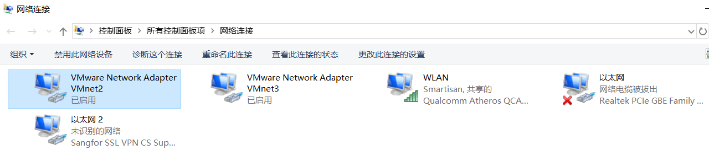
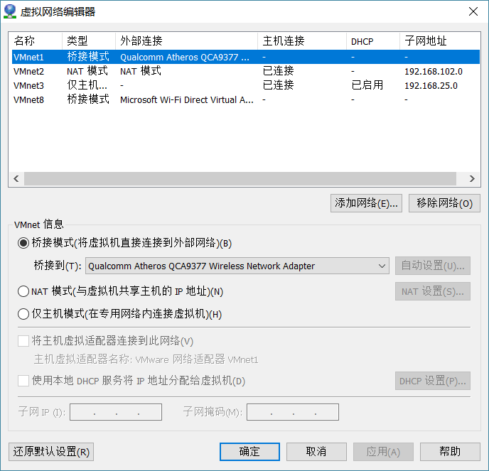
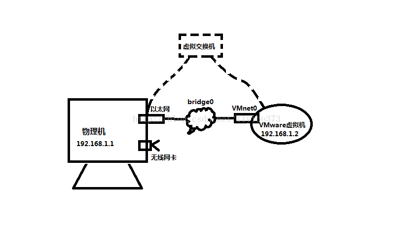
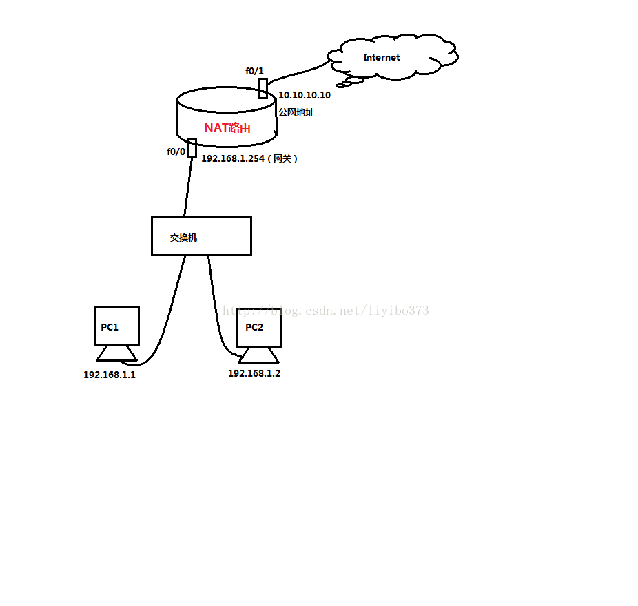
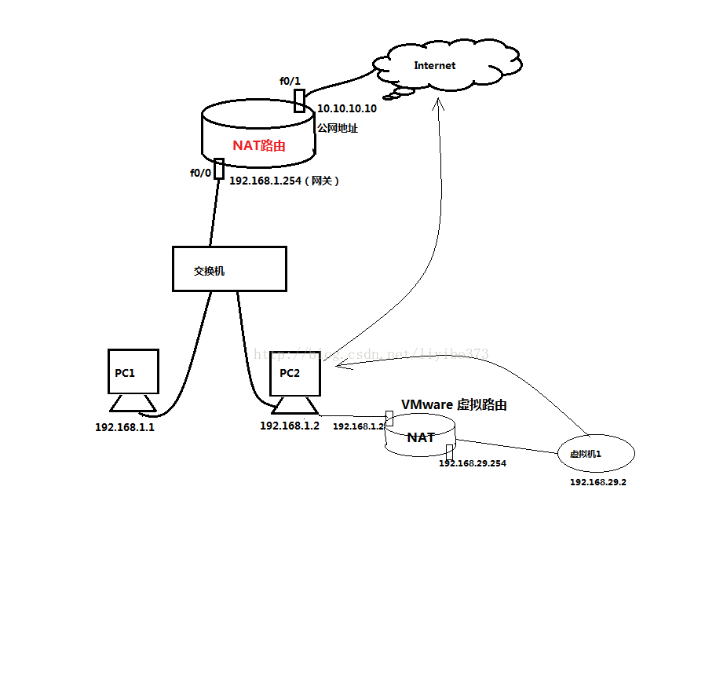
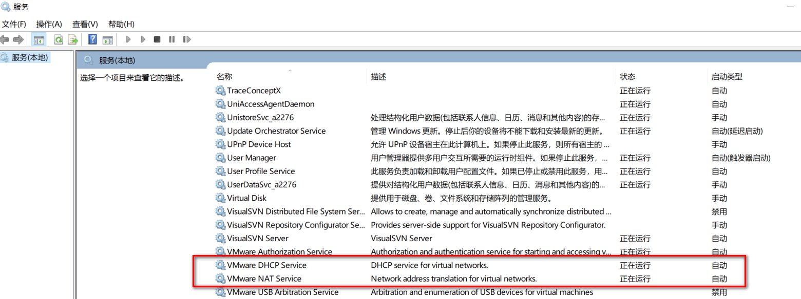
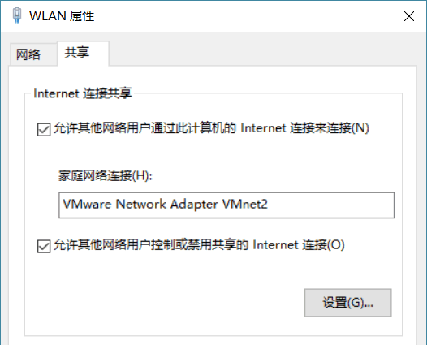
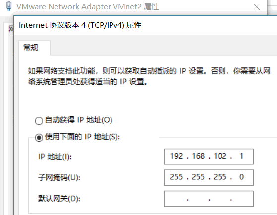
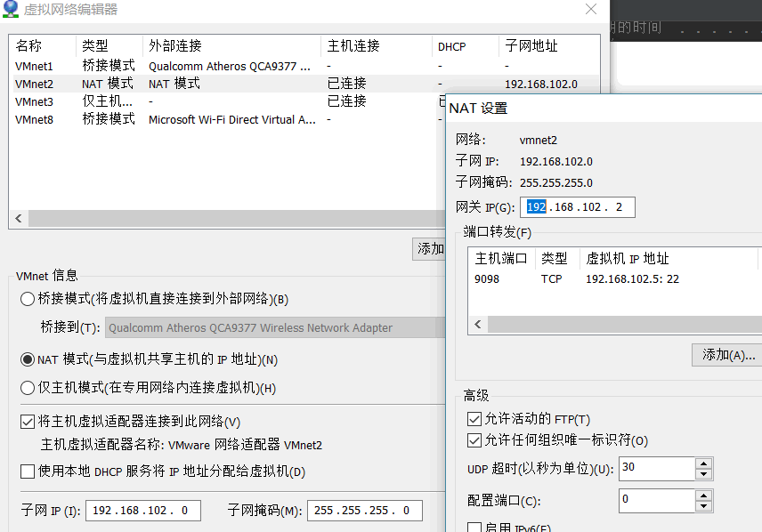
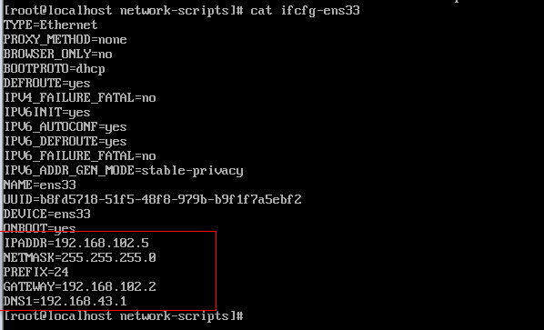

## 01-VMware虚拟机配置

### 一、VMwareworkstations 虚拟化

VMware workstations是一款由VMware公司研制的虚拟计算机的“软件”。
 
在VMwareworkstations里可以创建多个虚拟机（这些虚拟机的操作系统可以是Windows也可以是Linux），这些虚拟机共用物理机的CPU、内存等。

VMware workstations就是寄居架构的虚拟化，它的前提是物理机已经有操作系统了，然后VMware workstations安装在物理机的操作系统上。

VMware vSphere就是原生架构的虚拟化，注意：VMware vSphere就是一个操作系统，就像windows和Linux一样，安装在物理机上；不同的是，VMware vSphere的安装不需要物理磁盘分区，只占用磁盘一小部分空间；在VMware vSphere操作系统上，再安装虚拟机，这种虚拟化结构就是原生架构。

### 二、VMware workstations 的网络模式

VMware workstations 的网络模式有三种，分别是桥接（bridge）模式、NAT模式和仅主机（host-only）模式。






### 三、网络模式解析

#### 3.1、桥接模式
真实的物理网卡与虚拟网卡VMnet1搭一条通道，这样好似把物理网卡和虚拟网卡VMnet1合二为一了，变成了一个新的网卡；假如，我们把这个网卡叫做bridge0，无论是物理机还是VMware虚拟机访问外网，都通过bridge0这个网卡来进行。

另外的说法是，当做了网卡的桥接，VMware里的虚拟机和物理机都处于同一个网段，由同一个交换机连接起来一样；当然，这个交换机也是虚拟的。



当创建完虚拟机后，在虚拟机编辑设置里，可以把网络模式设为桥接，这样就可以像物理机一样上网了。


#### 3.2、NAT模式
NAT就是“网络地址转换”，它的功能的实现需要路由器。它的作用就是把私网的ip地址转化为公网的ip地址来访问因特网。



那么，假如PC2中创建了虚拟机，选用nat模式，是怎么上网的？



虚拟机通过nat模式上网，其实是通过一个VMware虚拟的路由器，这个路由器是有Vmware这个软件虚拟出来的。

##### NAT模式下，虚拟机网络地址的配置

###### 关闭Centos7防火墙
```
systemctl stop firewalld
systemctl disable firewalld
chkconfig iptables off  #如果安装了iptables
```

###### 开启两个服务



######  无线网卡( 或本地连接) 上设置网络共享，选择 VMnet8



###### 使用 ipconfig -all 命令查看 DNS 、IPv4 等信息
```
以太网适配器 VMware Network Adapter VMnet2:

   连接特定的 DNS 后缀 . . . . . . . :
   描述. . . . . . . . . . . . . . . : VMware Virtual Ethernet Adapter for VMnet2
   物理地址. . . . . . . . . . . . . : 00-50-56-C0-00-02
   DHCP 已启用 . . . . . . . . . . . : 否
   自动配置已启用. . . . . . . . . . : 是
   本地链接 IPv6 地址. . . . . . . . : fe80::dda2:5002:eafb:ff8f%16(首选)
   IPv4 地址 . . . . . . . . . . . . : 192.168.102.1(首选)
   子网掩码  . . . . . . . . . . . . : 255.255.255.0
   默认网关. . . . . . . . . . . . . :
   DHCPv6 IAID . . . . . . . . . . . : 117461078
   DHCPv6 客户端 DUID  . . . . . . . : 00-01-00-01-20-58-90-D1-C8-5B-76-EE-DF-4E
   DNS 服务器  . . . . . . . . . . . : 127.0.0.1
   TCPIP 上的 NetBIOS  . . . . . . . : 已启用

以太网适配器 VMware Network Adapter VMnet3:

   连接特定的 DNS 后缀 . . . . . . . :
   描述. . . . . . . . . . . . . . . : VMware Virtual Ethernet Adapter for VMnet3
   物理地址. . . . . . . . . . . . . : 00-50-56-C0-00-03
   DHCP 已启用 . . . . . . . . . . . : 否
   自动配置已启用. . . . . . . . . . : 是
   本地链接 IPv6 地址. . . . . . . . : fe80::4f6:856c:c5a0:a610%13(首选)
   IPv4 地址 . . . . . . . . . . . . : 192.168.25.1(首选)
   子网掩码  . . . . . . . . . . . . : 255.255.255.0
   默认网关. . . . . . . . . . . . . :
   DHCPv6 IAID . . . . . . . . . . . : 134238294
   DHCPv6 客户端 DUID  . . . . . . . : 00-01-00-01-20-58-90-D1-C8-5B-76-EE-DF-4E
   DNS 服务器  . . . . . . . . . . . : 127.0.0.1
   TCPIP 上的 NetBIOS  . . . . . . . : 已启用

无线局域网适配器 WLAN:

   连接特定的 DNS 后缀 . . . . . . . :
   描述. . . . . . . . . . . . . . . : Qualcomm Atheros QCA9377 Wireless Network Adapter
   物理地址. . . . . . . . . . . . . : 58-00-E3-F0-4E-D9
   DHCP 已启用 . . . . . . . . . . . : 是
   自动配置已启用. . . . . . . . . . : 是
   本地链接 IPv6 地址. . . . . . . . : fe80::f97e:7342:aa6d:53a9%22(首选)
   IPv4 地址 . . . . . . . . . . . . : 192.168.43.173(首选)
   子网掩码  . . . . . . . . . . . . : 255.255.255.0
   获得租约的时间  . . . . . . . . . : 2021年3月19日 15:25:05
   租约过期的时间  . . . . . . . . . : 2021年3月19日 16:25:05
   默认网关. . . . . . . . . . . . . : 192.168.43.1
   DHCP 服务器 . . . . . . . . . . . : 192.168.43.1
   DHCPv6 IAID . . . . . . . . . . . : 123207907
   DHCPv6 客户端 DUID  . . . . . . . : 00-01-00-01-20-58-90-D1-C8-5B-76-EE-DF-4E
   DNS 服务器  . . . . . . . . . . . : 127.0.0.1
                                       192.168.43.1
   TCPIP 上的 NetBIOS  . . . . . . . : 已启用
```

###### 配置 VMnet2


###### 虚拟机, 单击菜单栏的 编辑–> 虚拟网络编辑器



###### 编辑 ifcfg-eth0
```
vi /etc/sysconfig/network-scripts/ifcfg-eth0
```



```
service network restart
```

#### 3.2、仅主机模式

模式其实很简单，虚拟机和物理机只要处于同一个网段，就可以通信，但是不能连接因特网。虚拟机ip属于哪个网段，要参考VMnet3这个网卡的网段。
