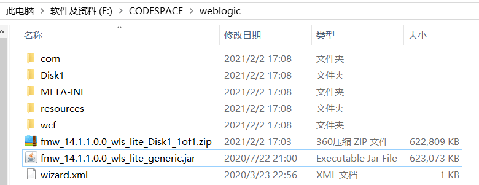
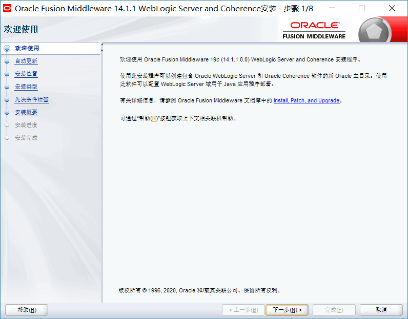
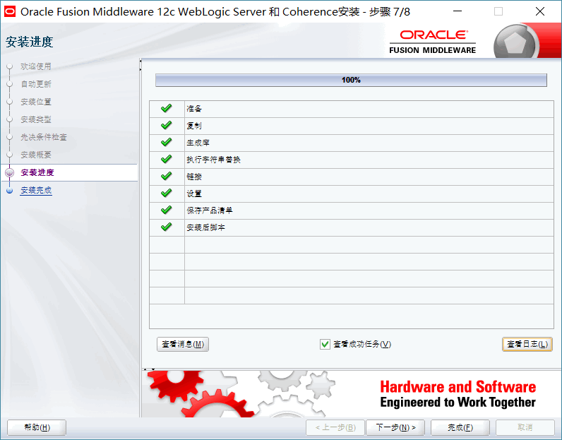
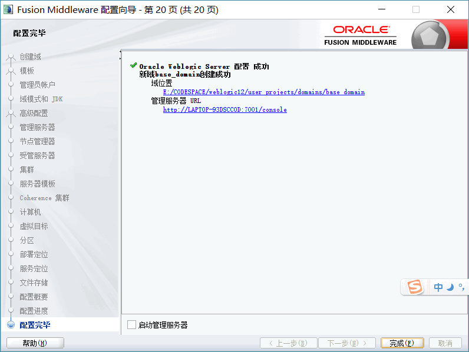
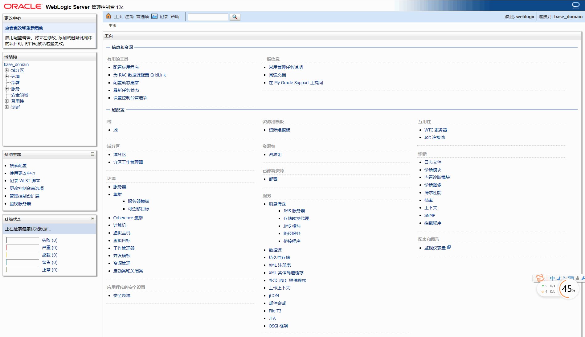

# Weblogic使用

### 一、WebLogic的介绍

WebLogic是美国bea公司出品的一个application server，确切的说是一个基于Javaee架构的中间件，纯java开发的，最新版本WebLogic Server 12cR2 (12.2.1.3)(截至发文前)是迄今为止发布的最卓越的BEA应用服务器。BEA WebLogic是用于开发、集成、部署和管理大型分布式Web应用、网络应用和数据库应用的Java应用服务器。将Java的动态功能和Java Enterprise标准的安全性引入大型网络应用的开发、集成、部署和管理之中。完全遵循J2EE 1.4规范。

#### WebLogic与Tomcat的区别：     
WebLogic更加强大。weblogic是j2ee的应用服务器（application server），包括ejb ,jsp,servlet,jms等等，全能型的。是商业软件里排名第一的容器（JSP、servlet、EJB等），并提供其他如JAVA编辑等工具，是一个综合的开发及运行环境。

WebLogic应该是J2EE Container(Web Container + EJB Container + XXX规范)，而Tomcat只能算Web Container，是官方指定的JSP&Servlet容器。只实现了JSP/Servlet的相关规范，不支持EJB。不过Tomcat配合jboss和apache可以实现j2ee应用服务器功能


### 二、WebLogic下载
来到Oracle的WebLogic Server主页：  
```
http://www.oracle.com/technetwork/middleware/weblogic/overview/index.html
https://www.oracle.com/middleware/technologies/weblogic-server-downloads.html
```           

下载完成：fmw_14.1.1.0.0_wls_lite_Disk1_1of1.zip 。解压 fmw_14.1.1.0.0_wls_lite_generic.jar。再解压如下：


打开目录中的Disk/install安装目录，找到名为ng.cmd的脚本文件：

双击打开脚本文件，弹出一个黑色的控制台：

稍等片刻，就会出现WebLogic的安装界面：

接下来按照以下步骤进行安装：




### 三、Weblogic的配置
安装完毕之后，会弹出配置窗口。参考：https://blog.csdn.net/acmman/article/details/70093877 进行配置。




### 四、简单操作Weblogic
访问：http://localhost:7001/console


参考资料：  
https://blog.csdn.net/acmman/article/details/70093877

https://www.docin.com/p-242278357.html
