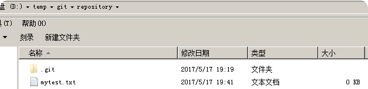

## 01-git

### 一、git的历史
同生活中的许多伟大事件一样，Git 诞生于一个极富纷争大举创新的年代。Linux 内核开源项目有着为数众广的参与者。绝大多数的 Linux 内核维护工作都花在了提交补丁和保存归档的繁琐事务上（1991－2002年间）。到 2002 年，整个项目组开始启用分布式版本控制系统 BitKeeper 来管理和维护代码。    
到 2005 年的时候，开发 BitKeeper 的商业公司同 Linux 内核开源社区的合作关系结束，他们收回了免费使用 BitKeeper 的权力。这就迫使 Linux 开源社区（特别是 Linux的缔造者 Linus Torvalds ）不得不吸取教训，只有开发一套属于自己的版本控制系统才不至于重蹈覆辙。他们对新的系统订了若干目标：
- 速度
- 简单的设计
- 对非线性开发模式的强力支持（允许上千个并行开发的分支）
- 完全分布式
- 有能力高效管理类似 Linux 内核一样的超大规模项目（速度和数据量）


### 二、git与svn的对比
#### 2.1、svn
SVN是集中式版本控制系统，版本库是集中放在中央服务器的，而干活的时候，用的都是自己的电脑，所以首先要从中央服务器哪里得到最新的版本，然后干活，干完后，需要把自己做完的活推送到中央服务器。集中式版本控制系统是必须联网才能工作，如果在局域网还可以，带宽够大，速度够快，如果在互联网下，如果网速慢的话，就郁闷了。


集中管理方式在一定程度上看到其他开发人员在干什么，而管理员也可以很轻松掌握每个人的开发权限。

但是相较于其优点而言，集中式版本控制工具缺点很明显：
- 服务器单点故障
- 容错性差

#### 2.2、Git
Git是分布式版本控制系统，那么它就没有中央服务器的，每个人的电脑就是一个完整的版本库，这样，工作的时候就不需要联网了，因为版本都是在自己的电脑上。既然每个人的电脑都有一个完整的版本库，那多个人如何协作呢？比如说自己在电脑上改了文件A，其他人也在电脑上改了文件A，这时，你们两之间只需把各自的修改推送给对方，就可以互相看到对方的修改了。


### 三、git工作流程
一般工作流程如下：
- 1、从远程仓库中克隆 Git 资源作为本地仓库。
- 2、从本地仓库中checkout代码然后进行代码修改
- 3、在提交前先将代码提交到暂存区。
- 4、提交修改。提交到本地仓库。本地仓库中保存修改的各个历史版本。
- 5、在修改完成后，需要和团队成员共享代码时，可以将代码push到远程仓库。


### 四、git的安装
#### 4.1、软件下载
下载地址：https://git-scm.com/download

#### 4.2、软件安装
##### 4.2.1、安装git for windows

##### 4.2.2、安装TortoiseGit
配置开发者姓名及邮箱，每次提交代码时都会把此信息包含到提交的信息中。


安装完毕后在系统右键菜单中会出现git的菜单项。


##### 4.2.3、安装中文语言包


### 五、使用git管理文件版本
#### 5.1、创建版本库
什么是版本库呢？版本库又名仓库，英文名repository，可以简单理解成一个目录，这个目录里面的所有文件都可以被Git管理起来，每个文件的修改、删除，Git都能跟踪，以便任何时刻都可以追踪历史，或者在将来某个时刻可以“还原”。由于git是分布式版本管理工具，所以git在不需要联网的情况下也具有完整的版本管理能力。

使用git bash也可以使用tortoiseGit。首先，选择一个合适的地方，创建一个空目录


##### 5.1.1、使用GitBash
切换目录到仓库所在的目录。
创建仓库执行命令：
```
$ git init
```

##### 5.1.2、使用TortoiseGit


版本库创建成功，会在此目录下创建一个.git的隐藏目录，如下所示：


概念
- 版本库：“.git”目录就是版本库，将来文件都需要保存到版本库中。
- 工作目录：包含“.git”目录的目录，也就是.git目录的上一级目录就是工作目录。只有工作目录中的文件才能保存到版本库中。

#### 5.2、添加文件
##### 5.2.1、添加文件过程
在D:\temp\git\repository目录下创建一个mytest.txt文件




文本文件变为带“+”号的图标：


提交文件：在mytest.txt上再次点击右键选择“提交”，此时将文件保存至版本库中。


如果是需要提交到不同的分支下。先转换到所需要提交的那个分支下。


